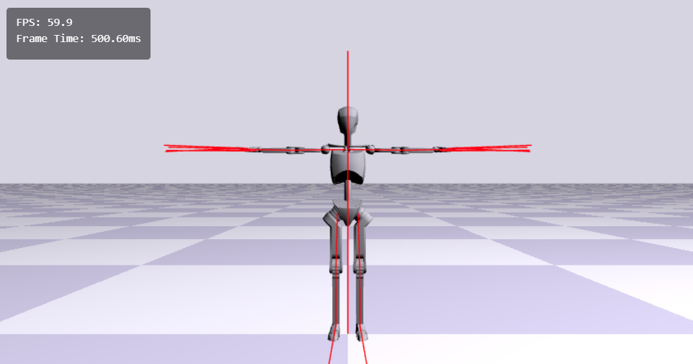

# WebGL Motion Experiments

This repository contains experiments with motion interpolation and skinning, implemented using WebGL.

The rendering engine is bundled using Vite and can be run using `npm run dev`. 

Shaders are compiled using a custom glsl parser (`glsl-parser.cjs`) and can be recompiled using `node glsl-parser.cjs` to compile shaders to `src/pathtracer/Shaders.ts`. 