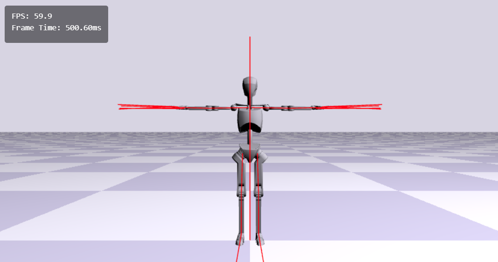

# WebGL Motion Experiments

This repository contains experiments with motion interpolation and skinning, implemented using WebGL.

The rendering engine is bundled using Vite and can be run using `npm run dev`. 

Shaders are compiled using a custom glsl parser (`glsl-parser.cjs`) and can be recompiled using `node glsl-parser.cjs` to compile shaders to `src/pathtracer/Shaders.ts`. 

## TODO
 - [ ] Incorporate BVH file parsing to visualize motions from the motion dataset
 - [ ] Refactor application state management for better readability and maintenance

## Legacy Files
These files are kept for reference but are not part of the main project.
 - `src/shaders/pathtracing/*`: Old pathtracing shaders, useful if we want to add better rendering modes.